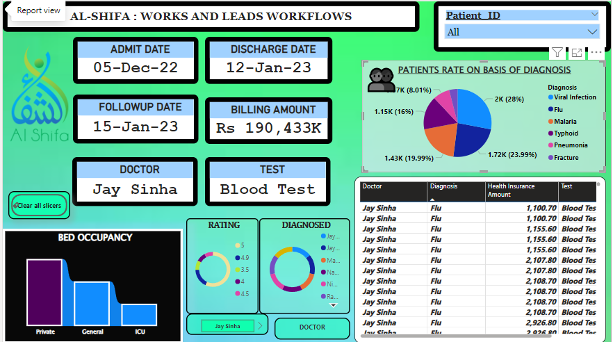

  <h1><b>Power BI Analysis: AL-SHIFA HOSPITAL DOCTOR & PATIENTS DATASET</b></h1>

  <h2>Overview</h2>
  
This repository contains a Power BI analysis of a dataset encompassing doctors' and patients' details within a healthcare system. The analysis aims to derive actionable insights to enhance operational efficiency.

  <h2>Key Insights</h2>
  <ul>
    <li>📊<b>Data Cleaning with Power Query</b>: Ensuring data integrity and consistency.</li>
    <li>📈<b>Data Visualization with Power BI</b>: Creating interactive visualizations for insightful analysis.</li>
  </ul>

  <h2>How to Get This Project:</h2>
  <ul>
    <li>⬇️Download the zip folder / code.</li>
    <li>🖥️Open Power BI Desktop and load the project.</li>
    <li>📂Explore and analyze the dataset interactively.</li>
    <li>📑The Excel dataset, logo, and theme are provided in the downloadable zip folder.</li>
  </ul>

  <h2>Static View of Dashboard</h2>
  

   ## Static View of Dashboard

     <source src="b1vi 2024-06-30 09-54-08.mp4" type="video/mp4"> 
    
    
  

</body>
</html>

